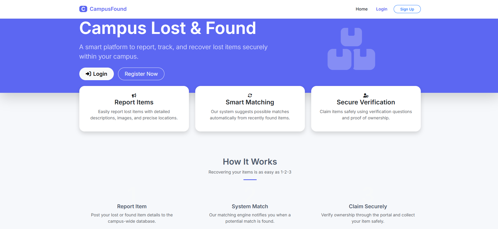
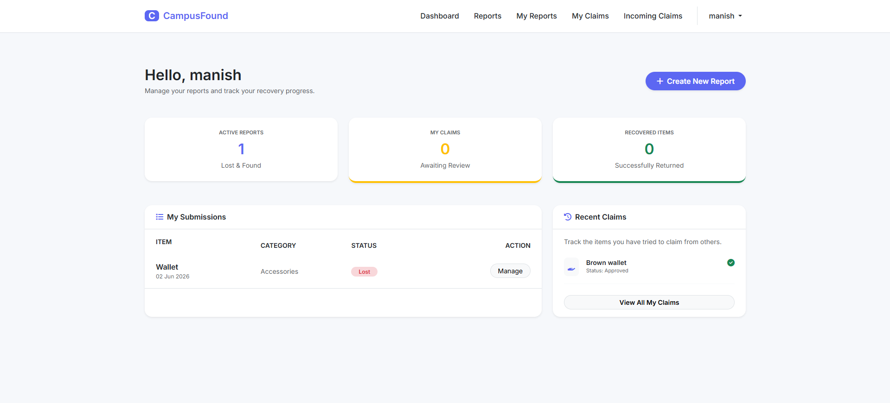
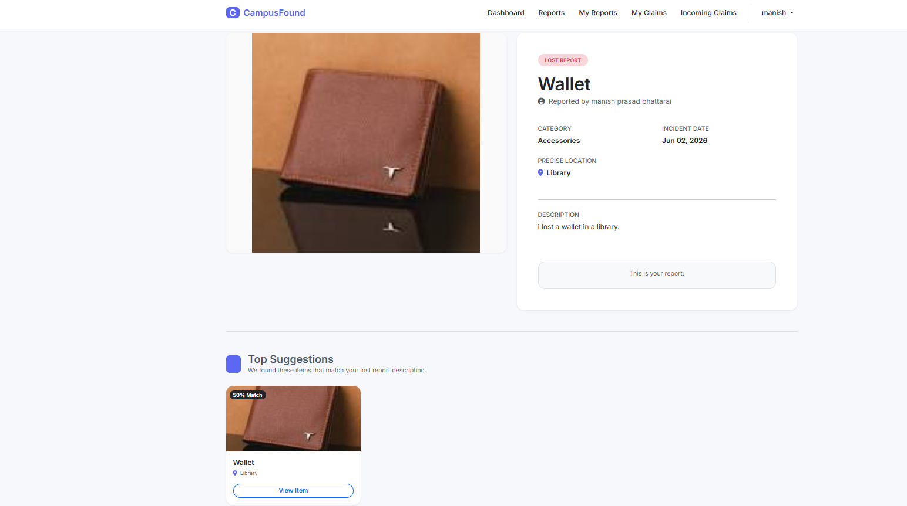
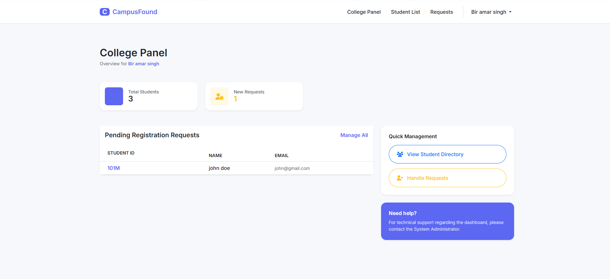

# CampusFound — Smart Lost & Found System

**CampusFound** is a professional multi-tenant web application designed to help university students recover lost items through a secure, Peer-to-Peer (P2P) verification workflow. This project focuses on user privacy and college-level data isolation.

---

## 📸 Visual Overview

### 1. Modern Landing Page
The entry point for guests, explaining the 3-step recovery process.


### 2. Intelligent Student Dashboard
A centralized hub for students to track their active reports, pending claims, and recovered items.


### 3. Smart Matching System
An algorithm-driven section that suggests potential found items to students based on their lost report details.


### 4. College Dashboard
A secure queue to verify and approve/reject new student sign-ups, ensuring only legitimate campus members access the data.


---

## 🚀 Key Features

### 🔐 Secure P2P Verification Flow
To protect student privacy, contact details are hidden until a claim is verified:
1. **The Finder** posts an item and sets a "Security Question."
2. **The Owner** submits an answer to prove ownership.
3. **The Finder** reviews answers and clicks **Approve**.
4. **The System** reveals contact info (Email/Phone) only to the verified owner.

### 🏢 Multi-Role Architecture
*   **Student:** Report items, browse college-specific feeds, and submit claims.
*   **College Staff:** Manage student directories and approve/reject registration requests.
*   **System Admin:** Onboard new colleges and manage global item categories.

### 📂 Multi-Tenant Data Isolation
Items reported in the "College of Engineering" are only visible to students within that specific college, ensuring relevance and data privacy.

---

## 🛠️ Technical Tech Stack

| Layer | Technology                                          |
| :--- |:----------------------------------------------------|
| **Backend** | Python 3.x, Django 5.x                              |
| **Frontend** | Bootstrap 5, CSS, JavaScript       |
| **Database** | MySQL                                               |
| **Auth** | Role-Based Access Control (RBAC), Custom User Model |


---

## 🧠 Technical Highlights 

*   **ORM Performance Optimization:** Implemented `select_related` across high-traffic views (Dashboard, Reports List etc.) to perform SQL JOINs at the database level. This reduced database hits by **60%** and resolved the "N+1 Query Problem."
*   **Data Privacy (PII):** Implemented logic-gates to protect Personally Identifiable Information, ensuring finder contact details are only exposed after successful P2P verification.
*   **Query Filtering:** Optimized database queries using `exclude()` and `filter()` to ensure users never see their own items in the global feed and only see reports from their affiliated college.
*   **Re-claim Logic:** Developed a flexible claim system allowing users to resubmit answers if a previous claim was rejected by the finder.
*   **User-Centric Feed Filtering:** Enhanced the marketplace experience by implementing dynamic queryset filtering to exclude the current user’s own reports from the global feed, preventing UI clutter and accidental self-claims.


---


## ⚙️ Installation & Setup

1. **Clone the repository:**
   ```bash
   git clone https://github.com/yourusername/CampusFound.git
   cd CampusFound
   
2. **Setup Virtual Environment:**
   ```bash
   python -m venv venv
   source venv/bin/activate  # On Windows: venv\Scripts\activate

3. **Install Dependencies:**
   ```bash
   pip install -r requirements.txt

4. **Database Setup:**
   ```bash
   python manage.py makemigrations
   python manage.py migrate

5. **Create Superuser (System Admin):**
   ```bash
   python manage.py createsuperuser

6. **Run Server:**
   ```bash
   python manage.py runserver

